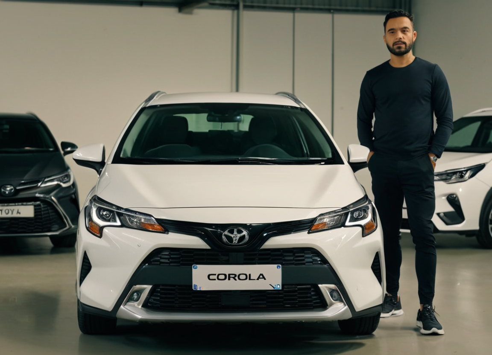

# AI - Image Master Hackathon

> [!Prompt]
> Arab man looking at camera standing besides (Toyota Corolla Cross XLE 2022: 1) (embedding:crpht-4300:0.9) in a well lit garage 
> (embedding:ziprealism:1) (embedding:OverallDetailXL:1)
**Objective:** Generate visually stunning and contextually apporiate product images that strictly adhers to the industrial design of the product The AI should.

**Subject:** Toyota Corolla Cross XLE 2022

## Approach

### Step 1 (Gather Training Data):
----
Scrape high quality images of the subject
- Sources are located in `scrape_resources` Directory
- Images are extracted using script [scrape_images.py](./scrape_images.py)
  - The script uses regex to extract image URL from page sources and download the images using requests library
- Downloaded Images are located in `scraped_images` directory
- Few images are selected for training and copied to `train-images` directory

### Step 2 (Training Preparation)
The selected images needs to be prepared for Training
- Images needs to captioned
- For captioning I have used `GPT-4o` Vision capabilites
- Images are sent to `GPT-4o` with crafted prompts to generate captions
- Generated captions are saved in `train-images` directory with same name as images but with `.txt` extension
- The code to caption images is written in [caption_images.py](./caption_images.py) file
- **TODO:** Due to time and resource constract I am not able to generate regularization images it will increase effectiveness of the trained model

### Step 3 (Training)
For training the model I have tried to create a [LoRA Model](https://arxiv.org/pdf/2106.09685) 
- The model was trained on following hardware

- Training was done using [kohya_ss](https://github.com/bmaltais/kohya_ss)
- [Juggernaut XL](https://huggingface.co/RunDiffusion/Juggernaut-X-v10) is used as base model to train LoRA
- Training parameters are saved in [kohya_ss_config.json](./kohya_ss_config.json)
- Results of training are saved in `models/checkpoint` directory

### LoRA Evaluation
Following are result of LoRA evaluation
  - 
  - 

- For different weight of the LoRA we can draw following observations
  - The LoRA can consistently produce images of the subject ie. Toyota Corolla Cross XLE 2022
  - Higher values of the LoRA blows the images
  - The best range of operation is from `0.1 to 0.25`
  - The Trained is clearly overfitted and further tuning model parameters will produce more prominent results

## Model Execution Model 
- LoRA models can be run on [stable-diffusion-webui](https://github.com/AUTOMATIC1111/stable-diffusion-webui) [Fooocus](https://github.com/lllyasviel/Fooocus)
- I will also be using following Emmbeding models 
  - [Ziprealism](https://civitai.com/models/148131?modelVersionId=165259),
  - [Ziprealism Negetive](https://civitai.com/models/148131?modelVersionId=165424)
  - [Detail++](https://civitai.com/models/98259/detail)
- It provides an Easy to use interface to generate images from Stable Diffusion XL models
- The Model could be access using Gradio Client from a python application

## Future Scope
- Exploring the possibility to utilize [ADetailer](https://github.com/Bing-su/adetailer) to improve Character faces
  - ADetailer is an extension for the stable diffusion webui that does automatic masking and inpainting of spcefic features like Character's face and add details to it

- Exploring `Depth Map` ControlNet
 - Create Depth Map from the image
 - 
 - Depth map contains imformation about depth of the image lighter shades are near to camera and dark shades are far from Camera
 - The Depth map can be passed to control net to influence placement of objects in the seen 
